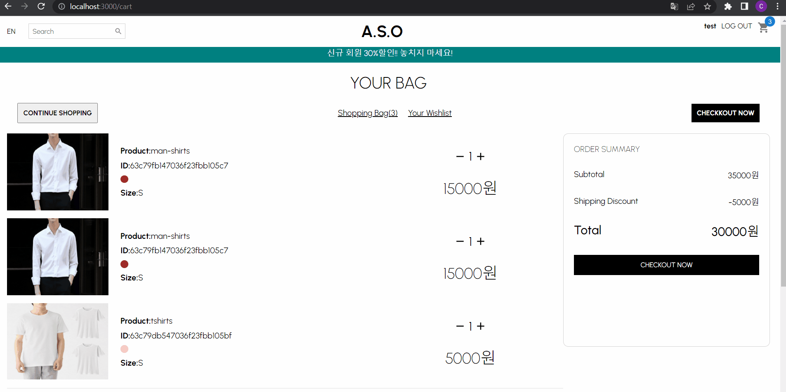
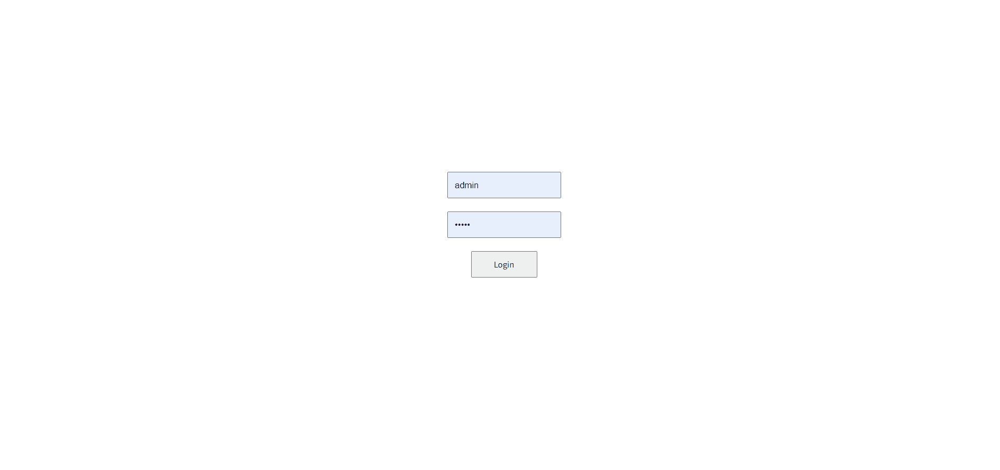

# shopping_mall_shop APP

### `npm start`

Runs the app in the development mode.\
Open [http://localhost:3000](http://localhost:3000) to view it in your browser.

The page will reload when you make changes.\
You may also see any lint errors in the console.

### `기술 스택`

- node.js
- styled-components
- axios
- redux-toolkit
- react-stripe-checkout
- firebase

- DB: MongoDB

### 프로젝트 설명 & 서비스

# 사용자

- login,register: 로그인,로그아웃,회원가입 구현
- 메인페이지 : 상품 카테고리별로 이동 가능하게 구현
- productDetail: 상품의 자세한 내용이 적혀있음, 상품의 수량 색깔을
  골라서 장바구니로 이동 가능함
  (navbar에서 장바구니에 넣은 상품 갯수를 알 수 있음)

- 반응형으로 구현
  

- 메인페이지들

- 필터를 통해 카테코리,사이즈별로 제품을 볼 수 있음
- 가격이 높은 순서, 낮은 순서 등으로 제품을 볼 수 있음
- 클릭시 제품 상세페이지로 감
- 제품의 색상은 좀 더 시각화가 잘 될수 있게 색깔로 표현함

- stripe를 통해 결제를 구현함
- 실제로 결제 후에 성공하면 성공페이지로 넘어감
- 유저가 쇼핑을 더 할지 아니면 결제를 할지 선택할 수 있음

# Adimn

## login: admin 자격이 있어야 메인 페이지를 볼 수 있음(id:admin,password:12345)

## homePage
  /: 월별 사용자를 그래프로 볼 수 있음
  최근 사용자를 볼 수 있음( 인원수 조정 가능 현재는 5명으로 조정함 )
  주문 내역을 확인할 수 있음
- Revanue : 이번달과 작년달의 매출을 확인할 수 있음

## userPage
 - /user : user 목록을 한번에 볼수 있음
 - /user/:userId: user의 자세한 정보를 볼수 있음, 개인정보 업데이트도 가능함
  

## Products
  - 제품들을 한번에 다 확인할 수 있음
  - 제품을 삭제할 수 있음(db에서 삭제됨)
  - /product/:id :  가격 등 상품을 편집할수 있음
  - /newproduct 로 가면 새로운 상품을 등록할 수 있음(firebase사용)

  

  

## 나중에 추가할 기능

- 장바구니에서 수량 고칠수 있게
- 주문 상품을 장바구니에서 골라서 주문할 수 있게
- 주문 내역 구현
